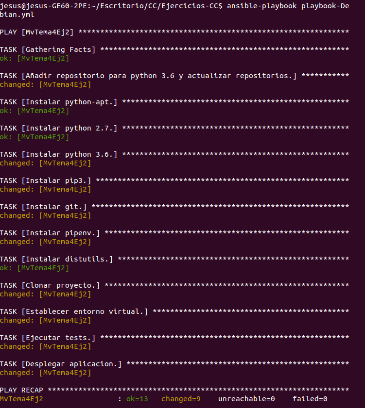

### Ejercicio 1: Crear una máquina virtual Ubuntu e instalar en ella un servidor nginx para poder acceder mediante web.

En primer lugar instalamos el CLI clásico de Azure con el siguiente comando.

~~~
$ sudo npm install -g azure-cli
~~~

Con esto instalamos el CLI clásico de azure con el gestor de paquetes npm. Se utiliza este gestor debido a que el CLI de Azure está basado en node.js.

En primer lugar debemos logearnos en azure desde el CLI con el comando.

~~~
$ azure login
~~~

Este comando nos dirá que accedamos a un enlace desde el navegador para iniciar sesión en Azure. Una que nos hayamos autenticado en el navegador veremos en la terminal el mensaje "login command OK", lo cual significará que ya estamos autenticados.

Al logearnos, el CLI nos informará de las subscripciones que tenemos disponibles y establecerá una por defecto.

A continuación creamos un grupo de recursos al cual pertenecerá la MV. Este grupo deberá de estar localizado en un centro de datos como North Europe, por ejemplo, y para seleccionar esta localización consultamos la lista de localizaciones de Azure con el comando.

~~~
$ azure location list
~~~

Con este comando vemos que Azure nombra a la localización North Europe como "northeurope". Este es el nombre que debemos utilizar para establecer la localización del grupo de recursos.

Tras esto, creamos el grupo de recursos con el comando.

~~~
$ azure group create --name Tema4 --location northeurope
~~~

Este grupo de recursos pertenecerá a la subscripción que tengamos activa en el momento de crearlo.

Ahora, debemos de elegir una imagen de Ubuntu a instalar en la MV. Para ello, podemos consultar la lista de imágenes que proporciona Azure con el comando.

~~~
$ azure vm image list
location: northeurope
publisher: Canonical
~~~

El comando anterior nos pedirá la localización de las imágenes a consultar y su publicador. En este caso, queremos las imágenes de North Europe cuyo publicador sea Canonical, al ser esta la compañía oficial que distribuye Ubuntu. Esto nos mostrará muchas imágenes con versiones distintas de Ubuntu. Vamos a elegir de esa lista una de las muchas imágenes con Ubuntu 18.04 LTS.

En la lista de imágenes anterior nos aparecerá cada imagen idientificada por su alias URN el cual tiene el formato "Publisher:Offer:Sku:Version". Podemos ver, por tanto, que una imágen de Azure tiene cuatro atributos:

- Publisher: Organización que crea la imagen.
- Oferta: Nombre que le da el Publisher a un grupo de imágenes relacionadas, como por ejemplo, Ubuntu Server (grupo de imágenes que contienen un SO Ubuntu Server).
- Sku: Una instancia concreta de una oferta, es decir, una imagen concreta.
- Version: Versión de una Sku.

Con estos cuatro atributos podemos indicarle a Azure cual es la imagen concreta que queremos para nuestra MV. En este caso utilizaremos la imagen Canonical:UbuntuServer:18.04-LTS:18.04.201812060. Esta es la imagen con Ubuntu Server 18.04 LTS más reciente de canonical.

Ahora creamos la MV con el siguiente comando.

~~~
az vm create --resource-group Tema4 --name MvTema4Ej1 --image Canonical:UbuntuServer:18.04-LTS:18.04.201812060 --admin-username azureuser --ssh-key-value ~/.ssh/id_rsa.pub
~~~

Mediante el comando anterior se ha creado una MV con Ubuntu Server 18.04-LTS en Azure llamada MvTema4Ej1 en el grupo de recursos anteriormente creado (Tema4). Además, dicha mv tendrá un usuario con derechos de administrador llamado azureuser, al cual accederemos mediante nuestra clave privada. Esto último se logra con el argumento --ssh-key-value en el cual le proporcionamos a Azure la ruta hacia nuestra clave pública para que la copie en el directorio correspondiente del usuario azureuser en la MV. Por último, cabe destacar que se ha utilizado la versión moderna del CLI de Azure para la creación de la MV, pues la clásica me ha dado bastantes problemas.

Tras la ejecución del anterior comando, obtenemos el siguiente resultado que confirma que la MV se ha creado de forma exitosa.

~~~
{
  "fqdns": "",
  "id": "/subscriptions/<subscripción>/resourceGroups/Tema4/providers/Microsoft.Compute/virtualMachines/MvTema4Ej1",
  "location": "northeurope",
  "macAddress": "00-0D-3A-B6-28-97",
  "powerState": "VM running",
  "privateIpAddress": "10.0.1.5",
  "publicIpAddress": "40.112.69.170",
  "resourceGroup": "Tema4",
  "zones": ""
}
~~~

Vemos como se nos devuelven algunos de los datos de la MV creada, como su IP pública, a través de la cual podemos acceder a ella mediante ssh.

Antes de instalar NGINX, tenemos que habilitar el puerto 80, pues por defecto, al crear una MV en Azure, esta solo tendrá abierto el puerto 22. Para ello, ejecutamos el siguiente comando.

~~~
az vm open-port --port 80 --resource-group Tema4 --name MvTema4Ej1
~~~

Ahora accedemos a la MV mediante ssh con el comando.

~~~
$ ssh azureuser@40.112.69.170
~~~

Una vez dentro de la MV ejecutamos los siguientes comandos para instalar el servidor web NGINX.

~~~
$ sudo apt-get -y update
$ sudo apt-get -y install nginx
~~~

Esto instalará en la MV un servidor NGINX, que escuchará peticiones a través del puerto 80. Con esto, si accedemos a la dirección IP de la MV desde el navegador de nuestro sistema local, veremos un mensaje de bienvenida de NGINX, lo que nos indica que el servidor web de NGINX se está ejecutando correctamente en la MV creada.

### Ejercicio 2: Crear una instancia de una máquina virtual Debian y provisionarla usando alguna de las aplicaciones vistas en el tema sobre herramientas de aprovisionamiento.

En primer lugar buscamos las imágenes Debian disponibles en northeurope con el comando.

~~~
$ az vm image list --location northeurope --offer Debian
~~~

En este caso, solo se ha encontrado una imagen de Debian 8, publicada por credativ, cuyo urn es credativ:Debian:8:latest. Entonces, creamos la MV con esta imagen dentro del recurso creado en el ejercicio 1 (Tema4) con el siguiente comando.

~~~
az vm create --resource-group Tema4 --name MvTema4Ej2 --image credativ:Debian:8:latest --admin-username azureuser --ssh-key-value ~/.ssh/id_rsa.pub
~~~

El comando anterior nos devuelve el siguiente resultado en JSON.

~~~
{
  "fqdns": "",
  "id": "/subscriptions/c8e823ea-5ece-4502-9e87-d89eaafc1ed2/resourceGroups/Tema4/providers/Microsoft.Compute/virtualMachines/MvTema4Ej2",
  "location": "northeurope",
  "macAddress": "00-0D-3A-B2-4C-E8",
  "powerState": "VM running",
  "privateIpAddress": "10.0.1.6",
  "publicIpAddress": "137.116.245.237",
  "resourceGroup": "Tema4",
  "zones": ""
}
~~~

Vemos como la MV se ha creado correctamente, que se encuentra ejecutándose y que su dirección IP pública es 137.116.245.237. Antes de aprovisionar la MV debemos de abrir el puerto 80 como hicimos en el ejercicio 1 con el comando.

~~~
az vm open-port --port 80 --resource-group Tema4 --name MvTema4Ej2
~~~

A continuación, ponemos los datos de esta MV en nuestro inventario de Ansible para poder provisionarla mediante el siguiente playbook (playbook del proyecto de CC).

~~~
---
 - hosts: MvTema4Ej2
   user: azureuser
   become: yes
   tasks:

   - name: Añadir repositorio para python 3.6 y actualizar repositorios.
     apt_repository: repo="deb http://ftp.de.debian.org/debian testing main" update_cache=yes state=present

   - name: Instalar python-apt.
     apt: pkg=python-apt state=present

   - name: Instalar python 2.7.
     apt: pkg=python state=present

   - name: Instalar python 3.6.
     apt: pkg=python3.6 state=present

   - name: Instalar pip3.
     apt: pkg=python3-pip state=present

   - name: Instalar git.
     apt: pkg=git state=present

   - name: Instalar pipenv.
     shell: pip3 install pipenv

   - name: Instalar distutils.
     apt: pkg=python3-distutils state=present

   - name: Clonar proyecto.
     git: repo=https://github.com/mesagon/Proyecto-CC-MII.git dest=~/Proyecto-CC-MII force=yes

   - name: Establecer entorno virtual.
     shell: pipenv install
     args:
       chdir: ~/Proyecto-CC-MII

   - name: Ejecutar tests.
     shell: pipenv run python3 test/test.py
     args:
       chdir: ~/Proyecto-CC-MII

   - name: Desplegar aplicacion.
     shell: pipenv run gunicorn --reload -D -b 0.0.0.0:80 app:app
     args:
       chdir: ~/Proyecto-CC-MII
~~~

Este playbook es similar al que utilizamos para aprovisionar la MV en el hito 3. La única diferencia está en las dos primeras tareas. La primera añade el repositorio testing a la lista de repositorios. Dicho repositorio es necesario para poder instalar python 3.6 en Debian, pues no está disponible por defecto en este SO. Tras esto, debemos instalar python-apt para poder manipular y peticionar información del repositorio de paquetes apt.

Al ejecutar el playbook anterior vemos en la siguiente imagen que el aprovisionamiento se lleva a cabo correctamente.

